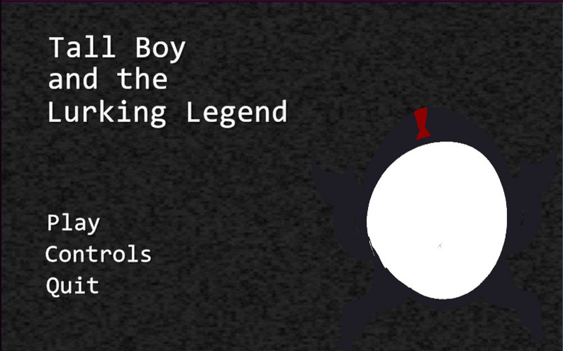
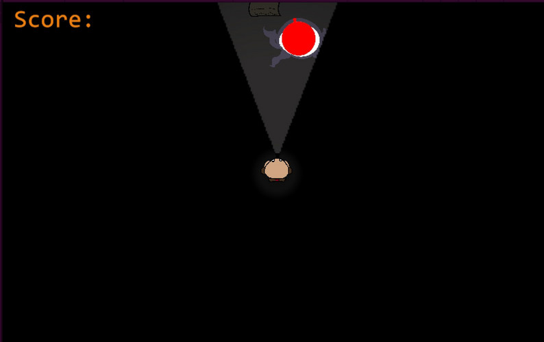
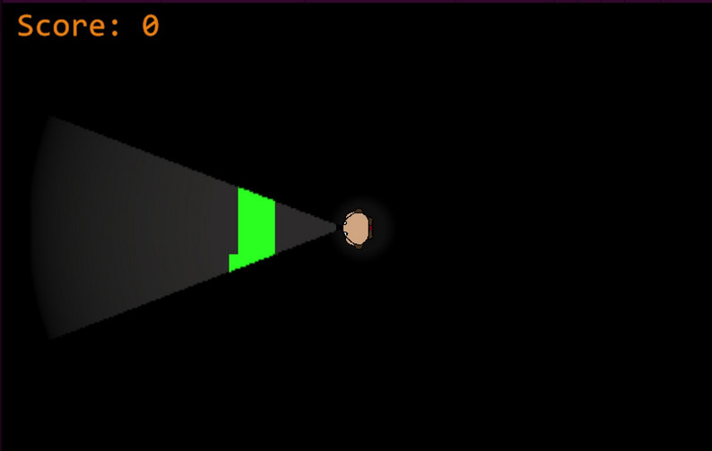

# The Tall Boy and the Lurking Legend

**A horror survival game built in three days for Scream Jam 2025.**

A tense horror survival experience where players must navigate the threat of a lurking legend. Designed, built, and shipped by a small team under a strict 72-hour game jam deadline.

*Created for Scream Jam 2025 — a team project built in Unity.*

**[Play on Itch.io ->](https://jland23.itch.io/tall-boy-and-the-lurking-legend)**

---

  

  

  

---

## Overview

The Tall Boy and the Lurking Legend is a horror survival game made during Scream Jam 2025, a 3-day game jam. The team designed, built, and shipped a complete playable experience within the deadline, from core gameplay to a full front-end of menus and UI.

## Description

Your friends have challenged you to a daring ritual on the night of Halloween! 

Your task is to collect the missing pages left by past wanderers. 

However, your task won't be easy. A legend warns about a mysterious figure the locals call "Tall Boy."

Collect the ten pages without being caught in order to escape Tall Boy's Forest!

## My Contributions

This was a collaborative team project. My focus was the game's front-end and player-facing flow:

- Designed and built the **complete UI and menu system** for the game.
- Engineered **intuitive, interactive menu flows** that guided players through the core gameplay mechanics.
- Worked within a **small development team** to design, build, and ship the game under a strict 3-day deadline.

## Built With

- **Engine:** Unity

- **Language:** C#

- **Art:** Aseprite

## Running the Project

To open the source in the Unity Editor:

1. Download the game Via **itch.io** or...
2. Download the **latest release** of the game.
3. Unzip the folder and **run** the application.

## Team

Jordan Landversicht\

Daniel Sible\

Nathaniel Klubek

## About This Project

Built during Scream Jam 2025 under a 72-hour deadline, this project was an exercise in rapid, collaborative development — scoping tightly, dividing work across a small team, and shipping a complete, polished experience on time.
